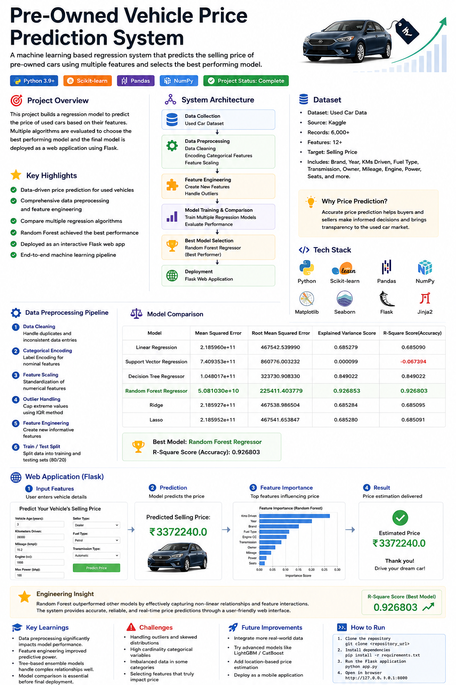
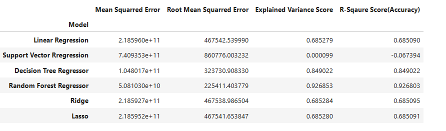
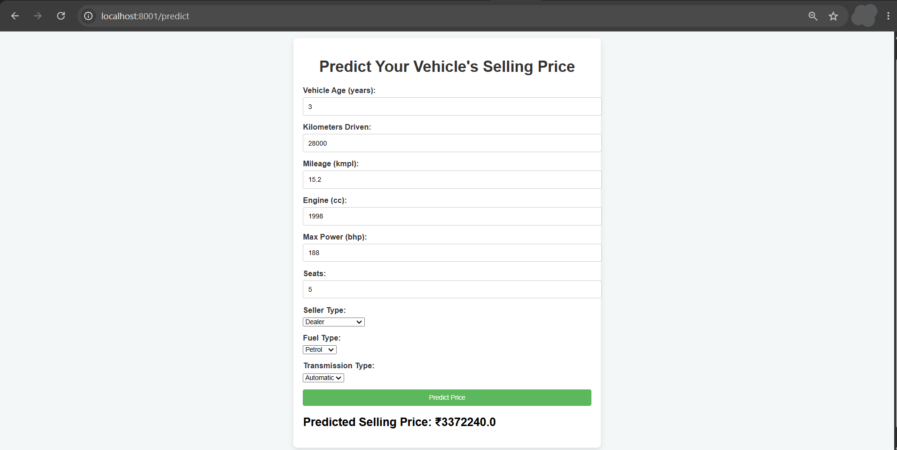

# Pre-Owned Vehicle Price Prediction System

An end-to-end machine learning web application that estimates the market value of pre-owned vehicles based on their specifications. The project combines data preprocessing, regression model comparison, hyperparameter tuning, and Flask deployment to provide real-time price predictions.

---

# Why I Built This

Buying or selling a pre-owned vehicle often involves uncertainty because pricing depends on multiple factors such as vehicle age, mileage, engine capacity, fuel type, transmission, and market demand.

I built this project to develop an intelligent pricing system that helps buyers and sellers estimate a vehicle's market value using historical data and machine learning rather than relying solely on manual judgment.

---

# Engineering Problem

Vehicle prices are influenced by numerous numerical and categorical features that interact in complex ways.

The challenge was to build a regression model capable of learning these relationships and producing reliable price estimates for previously unseen vehicles.

Rather than selecting the first model that performed reasonably well, I evaluated multiple regression algorithms and selected the best-performing model based on comparative evaluation.

---

# System Workflow

```text
Vehicle Dataset
        │
        ▼
Data Cleaning
        │
        ▼
Feature Engineering
        │
        ▼
Categorical Encoding
        │
        ▼
Regression Models
        │
        ▼
Model Comparison
        │
        ▼
Hyperparameter Tuning
        │
        ▼
Best Model Selection
(Random Forest)
        │
        ▼
Flask Web Application
        │
        ▼
Predicted Selling Price
```

---

# Dataset

The dataset contains historical information about pre-owned vehicles, including:

- Vehicle Age
- Kilometers Driven
- Fuel Type
- Seller Type
- Transmission
- Mileage
- Engine Capacity
- Maximum Power
- Number of Seats
- Selling Price

---

# Experimental Design

To identify the most suitable regression model, multiple machine learning algorithms were trained and evaluated using the same dataset and preprocessing pipeline.

The comparison ensured that model selection was based on performance rather than assumption.

---

# Model Comparison

The following regression models were evaluated:



Random Forest consistently produced the best prediction performance and was therefore selected as the final deployment model.

The trained model was exported as `best_model.pkl` for deployment.

---

# Web Application

The trained model is integrated into a Flask web application that enables users to estimate a vehicle's selling price through a simple browser interface.

Users provide vehicle details such as:

- Age
- Kilometers Driven
- Mileage
- Engine Capacity
- Maximum Power
- Number of Seats
- Fuel Type
- Seller Type
- Transmission

The application processes these inputs and instantly predicts the estimated market value.



---

# Key Engineering Decisions

## Why Random Forest?

Random Forest was selected after comparative evaluation because it provided the most reliable predictions across the validation dataset while effectively capturing non-linear relationships between vehicle features and selling price.

---

## Why Deploy with Flask?

A trained model alone cannot be used directly by end users.

Deploying the model with Flask transforms it into an interactive web application where users can obtain predictions without writing code.

---

## Why Hyperparameter Tuning?

Hyperparameter tuning was performed to optimize the model's predictive performance instead of relying solely on default model settings.

---

# Challenges Faced

During development, several practical challenges were encountered:

- Cleaning inconsistent vehicle records.
- Handling categorical variables.
- Selecting the most informative features.
- Comparing multiple regression models fairly.
- Deploying the trained model through Flask.
- Managing GitHub's file size limitation for trained model files.

---

# Key Learnings

This project strengthened my understanding of the complete machine learning lifecycle.

Key takeaways include:

- Data preprocessing for structured datasets.
- Feature engineering.
- Regression model comparison.
- Hyperparameter tuning.
- Model serialization using Pickle.
- Deploying machine learning models with Flask.
- Building end-to-end prediction systems.

---

# Tech Stack

### Programming

- Python

### Machine Learning

- Scikit-learn

### Data Processing

- Pandas
- NumPy

### Deployment

- Flask

### Frontend

- HTML
- CSS

### Development Environment

- Jupyter Notebook

---

# Project Structure

```text
Preowned_Vehicle_Price_Prediction/
│
├── app.py
├── requirements.txt
├── best_model.pkl
├── notebooks/
│   └── model_training.ipynb
├── templates/
│   └── index.html
├── static/
│   └── style.css
├── images/
│   ├── home_page.png
│   └── prediction_result.png
└── README.md
```

---

# Model Download

The trained model exceeds GitHub's recommended file size.

Download the model here:

👉 https://drive.google.com/file/d/1qIs0cZSpVHoi5IXf60WFD9GkhKz-WvJy/view?usp=sharing

Place `best_model.pkl` in the project root before running the application.

---

# Installation

## Clone Repository

```bash
git clone <repository-url>
```

## Install Dependencies

```bash
pip install -r requirements.txt
```

---

# Running the Application

```bash
python app.py
```

Open your browser:

```
http://localhost:8001
```

---

# Future Improvements

- Support additional vehicle brands and regional pricing trends.
- Incorporate current market demand and depreciation factors.
- Deploy the application to a cloud platform.
- Add model explainability using SHAP values.
- Build a REST API for third-party integration.

---
